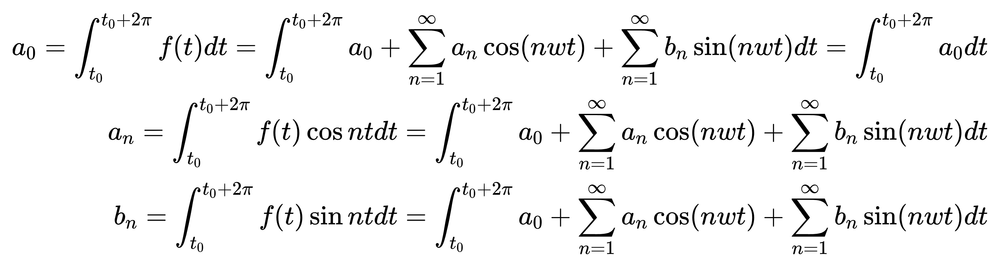

---
layout: post
title: "傅里叶级数的计算"
date: 2023-03-24
description: "傅里叶级数相关计算的数学推导"
tag: 傅里叶变换
---   

# 三角函数的正交性
## 三角函数系
三角函数系，即如下所示：
$$ {0,1, \cos \omega t, \sin \omega t, \cos 2 \omega t, \sin 2 \omega t, \ldots \ldots, \cos n \omega t, \sin n \omega t, \ldots \ldots} $$

其中，$0=\sin 0\omega t,1=\cos 0\omega t$。
## 函数正交
函数正交的概念是有些高深难懂的(我没搞懂)，**姑且**理解为下面的积分为零，即可认为$f(x)$与$g(x)$正交：

$$<f,g>=  \int  f(x)  g(x)dx$$

## 证明：三角函数系的正交性
首先，我们都知道**三角函数在一个周期内的积分为零**
$$\int_{t_{0}}^{t_{0}+2\pi} \sin wt d t=0$$
$$\int_{t_{0}}^{t_{0}+2\pi} \cos wt d t=0$$
然后，介绍一下积化和差公式：
$$
\begin{aligned}
\sin \alpha \cos \beta & =\frac{1}{2}[\sin (\alpha+\beta)+\sin (\alpha-\beta)] \\
\cos \alpha \sin \beta & =\frac{1}{2}[\sin (\alpha+\beta)-\sin (\alpha-\beta)] \\
\sin \alpha \sin \beta & =-\frac{1}{2}[\cos (\alpha+\beta)-\cos (\alpha-\beta)]
\end{aligned}
$$
对于任意的三角函数系中的函数都有：

$$
\begin{aligned}
\int \sin \alpha \cos \beta & dx=\frac{1}{2}[\int\sin (\alpha+\beta) dx+\int\sin (\alpha-\beta) dx] =0\\
\int \cos \alpha \sin \beta & dx=\frac{1}{2}[\int\sin (\alpha+\beta) dx-\int\sin (\alpha-\beta) dx] =0\\
\int \sin \alpha \sin \beta & dx=-\frac{1}{2}[\int\cos (\alpha+\beta) dx-\int\cos (\alpha-\beta) dx]=0
\end{aligned}
$$
# 傅里叶级数的三角函数形式

## 什么是傅里叶级数
法国数学家傅里叶认为，任何周期函数都可以用正弦函数和余弦函数构成的无穷级数来表示（选择正弦函数与余弦函数作为基函数是因为它们是正交的，如下所示：
$$f(t)=a_{0}+\sum_{n=1}^{\infty} [a_{n}\cos(nwt)+b_{n}\sin( nwt)]$$
## 如何计算 $a_{0},a_{n},b_{n}$

